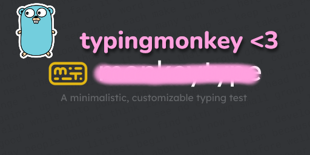

# TypingMonkey



### ♡ typing automation bot ♡

This is a typing automation bot for [MonkeyType](https://monkeytype.com/)! ପ(๑•ᴗ•๑)ଓ ♡

PLEASE DO NOT CHEAT WITH THIS ON LEADERBOARDS

(If monkeytype.com administrators don't like this published please open an issue with the right information and I will take it down from public eyes ASAP!)

## 🌸 Prerequisites 🌸
You'll need GeckoDriver to run this! ♪(´▽｀)

Download it here: [https://github.com/mozilla/geckodriver/releases](https://github.com/mozilla/geckodriver/releases)

> **Note:** (๑˃ᴗ˂)ﻭ A geckodriver is included for convenience, but it's **super duper recommended** to download the latest version from the official releases! ♡＼(￣▽￣)／♡ Security and compatibility are important.

## 🎀 How to Build 🎀
Building is super easy! (ﾉ◕ヮ◕)ﾉ*:･ﾟ✧

```bash 
go build ./cmd/typingmonkey 
```

**✧･ﾟ: *✧･ﾟ:* Important Note *:･ﾟ✧*:･ﾟ✧**
> The build output needs to be in the **same directory** as `geckodriver.exe`! Don't separate them or it won't work (｡•́︿•̀｡)

### Go Version
Built with **Go 1.21**! (◕‿◕✿)

## Libraries Used
- **Selenium** - for browser automation magic!
- **GeckoDriver** - Firefox WebDriver support
- Other super helpful Go packages that make everything work perfectly!
---
Made with lots of love and keystrokes! (づ｡◕‿‿◕｡)づ ♡
